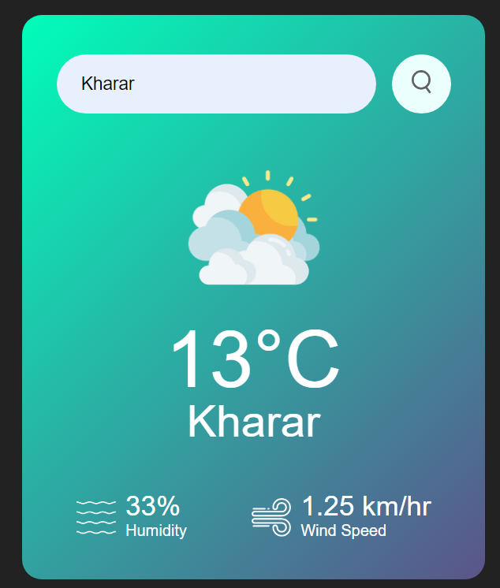

        City Weather Forecasts
Weather prediction, also known as weather forecasting, involves using various scientific techniques and models to forecast or predict the atmospheric conditions for a specific location at a given time in the future. This process is crucial for planning and making informed decisions across various sectors such as agriculture, transportation, disaster management, and more.

This is the home page of this appication when we run this application.

*** About this App :-
Search bar :- We include the search bar with a button for easily search any city in the world .

Weather Icon :- Here we can see that the weather type icon image is included in this app that look it more smart app and this is auto maticaaly change when the climate change like - in Gaya cloudy then clouds image .

Wind speed with humidity :- We include in it humidity as well as wind flow of that city it is also auto update according to that city you want.

OpenWeather API :- we use this API for fetch the current weather condition in that city you want and it best API for knowing the current weather condition in normal application.

Easy to use:- This application look very simple and easily we can undersatnd because it is based on siple html,css and javascript code .We include seperate file of each file and also a seperate folder for the images that used in this application.

Exception Handling:- We use the exception handling for the cases that appear in this application like city not found(invalid city) , key errors ,etc.

this image appear when you search any city that you want.

